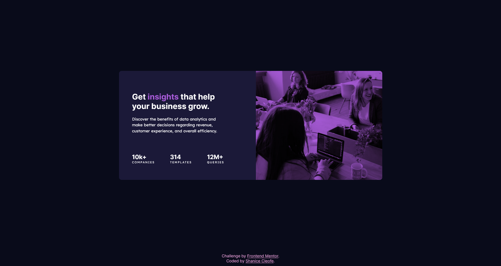
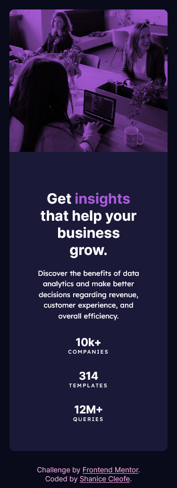

# Frontend Mentor - Stats preview card component solution

This is a solution to the [Stats preview card component challenge on Frontend Mentor](https://www.frontendmentor.io/challenges/stats-preview-card-component-8JqbgoU62). Frontend Mentor challenges help you improve your coding skills by building realistic projects.

## Table of contents

- [Overview](#overview)
  - [The challenge](#the-challenge)
  - [Screenshot](#screenshot)
  - [Links](#links)
- [My process](#my-process)
  - [Built with](#built-with)
  - [What I learned](#what-i-learned)
  - [Useful resources](#useful-resources)
- [Author](#author)

## Overview

### The challenge

Users should be able to:

- View the optimal layout depending on their device's screen size

### Screenshot

Desktop Preview


Mobile Preview


### Links

Links will be updated after the site is live and frontend solution is submitted

- Solution URL: [Add solution URL here](https://your-solution-url.com)
- Live Site URL: [Add live site URL here](https://your-live-site-url.com)

## My process

### Built with

- Semantic HTML5 markup
- CSS custom properties
- FlexBox
- Sass
- StyleLint

### What I learned

Today, I acquired the knowledge of setting up SASS through npm and incorporating automatic refresh functionality. I successfully applied fundamental SASS concepts such as variables, nesting, partials, and modules into my current project. I'm excited about utilizing this tool in my upcoming project and exploring new concepts.

SCSSS example

```scss
@media only screen and (max-width: $layout-breakpoint-medium) {
  main {
    .card {
      flex-direction: column-reverse;
      align-items: unset;
      max-height: unset;

      .card-content {
        padding: 60px;
        align-items: center;
        gap: 30px;

        .main-heading {
          padding: unset;
          text-align: center;
        }

        .stat-headings {
          padding: unset;
          flex-direction: column;
          text-align: center;
        }
      }

      .card-image .image {
        height: 300px;
      }
    }
  }
}
```

### Useful resources

- [ChatGPT](https://www.example.com) - This helped me for finding answers to my questions. I really liked this pattern and will use it going forward.

## Author

- Website - [Shanice](https://github.com/sdacleofe/about-me)
- Frontend Mentor - [@sdacleofe](https://www.frontendmentor.io/profile/sdacleofe)
